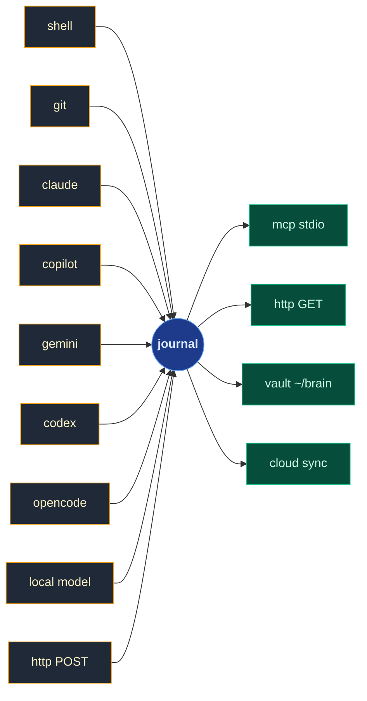

<div align="center">

# Urchin

**The universal substrate. Every tool, one memory.**


</div>

---

Claude, Copilot, Gemini, Codex, OpenCode, the shell, git — each tool has its own memory, none of them share. Urchin runs as a local daemon, collects signals from every tool into one append-only journal, and surfaces that journal through MCP and HTTP so any agent, IDE, or script can read what every other tool did.

> Urchin does not own your tools. It connects them.
> Additive. Passive. Nothing you already use loses anything.

---

## Architecture



Collectors are passive readers — they never write back to source tools. The journal is the spine. Everything else is a nerve.

---

## Roadmap

| Feature | Status | Notes |
|---|---|---|
| Core types + journal | ✅ shipped | `Event`, `Journal`, `Identity`, `Config` — append-only JSONL |
| Identity envelope | ✅ shipped | account/device on every event |
| TOML config + env overrides | ✅ shipped | defaults → `~/.config/urchin/config.toml` → env |
| HTTP intake | ✅ shipped | `POST /ingest`, `GET /health` — `127.0.0.1` only |
| MCP server (stdio) | ✅ shipped | JSON-RPC 2.0, 5 tools |
| Daemon mode | ✅ shipped | `urchin serve` — collector loop + intake server |
| Shell collector | ✅ shipped | `~/.bash_history`, byte-offset checkpoint |
| Git collector | ✅ shipped | per-repo SHA checkpoint, silent first run |
| Claude collector | ✅ shipped | `~/.claude/projects/` JSONL transcripts |
| Copilot collector | ✅ shipped | `~/.copilot/command-history-state.json`, content-addressed checkpoint |
| Gemini collector | ✅ shipped | `~/.gemini/tmp/*/chats/*.jsonl`, partial-offset checkpoint |
| Vault projection | ✅ shipped | `urchin vault project` — writes urchin block into `~/brain/daily/YYYY-MM-DD.md` |
| CLI: `recent` / `query` | ✅ shipped | `urchin recent --n 20`, `urchin query <text>` |
| Cloud sync | ✅ shipped | `urchin sync` — pushes journal to orinadus.com |
| Codex collector | 🔲 next | `~/.codex/state_5.sqlite`, threads table |
| OpenCode collector | 🔲 next | `~/.local/share/opencode/opencode.db`, message table |
| Local model collector | 🔲 next | generic JSONL drop file — works with Ollama, llama.cpp, anything |
| Collector registry | 🔲 next | trait-based, `is_available()` self-discovery, one-line registration |
| Remote sync bridge | 🔲 planned | pull/sync across WSL / VPS |

**56 tests** across `urchin-core` (7), `urchin-intake` (2), `urchin-mcp` (10), `urchin-collectors` (34), `urchin-vault` (3).

---

## Quick start

```bash
git clone https://github.com/orinadus-systems/urchin
cd urchin
cargo build                        # → target/debug/urchin
./target/debug/urchin doctor       # verify identity + journal state
```

---

## Commands

| Command | Purpose |
|---|---|
| `urchin doctor` | identity, config source, paths, journal stats |
| `urchin ingest` | write a single event from the CLI |
| `urchin serve` | start HTTP intake + collector tick loop (daemon) |
| `urchin mcp` | run MCP server over stdio (JSON-RPC 2.0) |
| `urchin collect shell` | run shell collector once |
| `urchin collect git --repo <path>` | run git collector |
| `urchin collect claude` | run Claude collector |
| `urchin collect copilot` | run Copilot collector |
| `urchin collect gemini` | run Gemini collector |
| `urchin collect all` | run every collector |
| `urchin recent [--n N] [--source S]` | show last N events |
| `urchin query <text>` | keyword search across journal |
| `urchin vault project [--date YYYY-MM-DD]` | project today's events into brain daily note |
| `urchin sync` | push journal to cloud |

---

## Crates

```
crates/
  urchin-core        zero I/O: Event, Journal, Identity, Config
  urchin-intake      axum: POST /ingest, GET /health (127.0.0.1:18799)
  urchin-mcp         MCP over stdio: 5 tools, JSON-RPC 2.0
  urchin-collectors  shell, git, claude, copilot, gemini — all live
  urchin-vault       vault projection: writes marker blocks into ~/brain
  urchin-sdk         shared types for external integrations
  urchin-cli         single binary: target/debug/urchin
```

---

## Event model

| Field | Type | Notes |
|---|---|---|
| `id` | UUID v4 | generated on create |
| `timestamp` | UTC ISO-8601 | |
| `source` | string | `claude` / `copilot` / `shell` / `mcp` / ... |
| `kind` | enum | `Conversation` / `Agent` / `Command` / `Commit` / `File` / `Other` |
| `content` | string | the payload |
| `workspace` / `session` / `title` / `tags` | optional | context |
| `actor` | optional | `{ account, device, workspace }` |

Append-only JSONL. Events are never mutated. Unknown fields are ignored on read.

---

## MCP tools

| Tool | Args | Purpose |
|---|---|---|
| `urchin_status` | — | event count, last event, paths, identity |
| `urchin_ingest` | `content`, `workspace` | write an event |
| `urchin_recent_activity` | `hours`, `source`, `limit` | recent events |
| `urchin_project_context` | `project` | match by content, tags, or workspace path |
| `urchin_search` | `query` | case-insensitive substring search |

Errors return `isError: true`. Queries return one line per event: `[timestamp] source — content`.

---

## Configuration

```toml
# ~/.config/urchin/config.toml — all optional
vault_root   = "/home/you/brain"
journal_path = "/home/you/.local/share/urchin/journal/events.jsonl"
intake_port  = 18799
cloud_url    = "https://www.orinadus.com/api/urchin-sync"
cloud_token  = "<bearer-token>"
```

| Env var | Overrides | Default |
|---|---|---|
| `URCHIN_VAULT_ROOT` | `vault_root` | `~/brain` |
| `URCHIN_JOURNAL_PATH` | `journal_path` | `~/.local/share/urchin/journal/events.jsonl` |
| `URCHIN_INTAKE_PORT` | `intake_port` | `18799` |
| `URCHIN_ACCOUNT` | identity account | `$USER` |
| `URCHIN_DEVICE` | identity device | hostname |
| `URCHIN_REPO_ROOTS` | git repos | colon-separated paths |
| `URCHIN_LOG` | log filter | `urchin=info` |

---

## Rules

> [!IMPORTANT]
> 1. `urchin-core` has zero I/O — pure types only.
> 2. The journal is append-only. Events are never mutated.
> 3. Vault writes happen only inside `<!-- URCHIN:* -->` marker blocks. Human content is never touched.
> 4. Collectors read. They never write back to source tools.
> 5. MCP is stdio, not HTTP.
> 6. One binary: `cargo build` → `target/debug/urchin`.

---

<div align="center">
<sub>Local-first. Additive. The substrate is not a product — it is infrastructure.</sub>
</div>
