<div align="center">

# Urchin

**The universal substrate. Every tool, one memory.**


</div>

---

Claude, Copilot, Gemini, Codex, OpenCode, the shell, git — each tool has its own memory, none of them share. Urchin runs as a local daemon, collects signals from every tool into one append-only journal, and surfaces that journal through MCP and HTTP so any agent, IDE, or script can read what every other tool did.

> Urchin does not own your tools. It connects them.
> Additive. Passive. Nothing you already use loses anything.

---

## Architecture

```mermaid
flowchart LR
    subgraph collectors["Collectors (read-only)"]
        SH[shell stdout]
        GIT[git log/diff]
        CL[claude webview]
        CP[copilot]
        GM[gemini]
        CDX[codex sqlite]
        OC[opencode sqlite]
        LM[local model jsonl]
        HI[http POST :9741]
    end

    subgraph daemon["urchin-core daemon"]
        J[(journal.jsonl)]
        DB[(SQLite index)]
        J -->|append + index| DB
    end

    subgraph consumers["Consumers"]
        MCP[MCP stdio\n9 tools]
        HTTP[HTTP GET\n/query]
        VAULT[vault projection\n~/brain]
        SYNC[cloud sync\norinadus-platform]
        IDE[IDE\nCursor / Zed]
    end

    SH  --> J
    GIT --> J
    CL  --> J
    CP  --> J
    GM  --> J
    CDX --> J
    OC  --> J
    LM  --> J
    HI  --> J

    DB --> MCP
    DB --> HTTP
    DB --> VAULT
    DB --> SYNC
    MCP --> IDE

    classDef col  fill:#1f2937,stroke:#f59e0b,color:#fef3c7
    classDef core fill:#1e3a8a,stroke:#60a5fa,color:#dbeafe,font-weight:bold
    classDef db   fill:#312e81,stroke:#818cf8,color:#e0e7ff,font-weight:bold
    classDef con  fill:#064e3b,stroke:#10b981,color:#d1fae5
    classDef ide  fill:#1c1917,stroke:#a78bfa,color:#ede9fe,font-weight:bold

    class SH,GIT,CL,CP,GM,CDX,OC,LM,HI col
    class J core
    class DB db
    class MCP,HTTP,VAULT,SYNC con
    class IDE ide
```



Collectors are passive readers. They never write back to source tools. The journal is the append-only spine. SQLite is the queryable index over it. MCP is the read surface for agents and IDEs.

---

## Roadmap

| Feature | Status | Notes |
|---|---|---|
| Core types + journal | ✅ shipped | `Event`, `Journal`, `Identity`, `Config` — append-only JSONL |
| Identity envelope | ✅ shipped | account/device on every event |
| TOML config + env overrides | ✅ shipped | defaults → `~/.config/urchin/config.toml` → env |
| HTTP intake | ✅ shipped | `POST /ingest`, `GET /health` — `127.0.0.1` only |
| MCP server (stdio) | ✅ shipped | JSON-RPC 2.0, 9 tools |
| Daemon mode | ✅ shipped | `urchin serve` — collector loop + intake server |
| Shell collector | ✅ shipped | `~/.bash_history`, byte-offset checkpoint |
| Git collector | ✅ shipped | per-repo SHA checkpoint, silent first run |
| Claude collector | ✅ shipped | `~/.claude/projects/` JSONL transcripts |
| Copilot collector | ✅ shipped | `~/.copilot/command-history-state.json`, content-addressed checkpoint |
| Gemini collector | ✅ shipped | `~/.gemini/tmp/*/chats/*.jsonl`, partial-offset checkpoint |
| Collector trait + registry | ✅ shipped | object-safe `Collector` trait, `CollectorRegistry::with_defaults()`, `is_available()` self-discovery |
| Codex collector | ✅ shipped | `~/.codex/state_5.sqlite`, threads table, `first_user_message` intent capture |
| OpenCode collector | ✅ shipped | `~/.local/share/opencode/opencode.db`, message JOIN session, user-role filter |
| Local model collector | ✅ shipped | `~/.local/share/urchin/local-model.jsonl` drop file — Ollama, llama.cpp, any harness |
| `urchin-agent` Reasoner trait | ✅ shipped | `EchoReasoner` (deterministic), `HttpReasoner` (Ollama-compat via `URCHIN_REASONER_URL`) |
| Ephemeral mode | ✅ shipped | `EphemeralMode` — file-backed flag + in-process `AtomicBool`, cross-process aware |
| Intake auth | ✅ shipped | Optional Bearer token (`URCHIN_INTAKE_TOKEN`), loopback-only |
| Journal write lock | ✅ shipped | `std::sync::Mutex<()>` — prevents intra-process line interleaving |
| SQLite projection index | 🔲 planned | Dual-write alongside JSONL for O(log n) queries |
| Lockless async intake | 🔲 planned | Tokio MPSC channel — high-throughput concurrent writes |
| OS-level collectors | 🔲 planned | Active window, inotify file watcher, AI traffic interceptor |
| WebView intercept | 🔲 planned | Phase 3 — Tauri captures ChatGPT/Gemini/Claude web natively |
| Vector embeddings | 🔲 planned | Phase 4 — upgrades `urchin_semantic_search` from token-cosine to real vectors |
| `.urchinignore` runtime | 🔲 planned | Phase 5 — spec exists in `SOVEREIGNTY.md`, not yet wired |
| Multi-device sync | 🔲 planned | Phase 6 — deterministic chunk sync |

**108 tests** across `urchin-core` (10), `urchin-intake` (8), `urchin-mcp` (20), `urchin-collectors` (52), `urchin-vault` (3), `urchin-agent` (15).

---

## Quick start

```bash
git clone https://github.com/orinadus-systems/urchin
cd urchin
cargo build                        # → target/debug/urchin
./target/debug/urchin doctor       # verify identity + journal state
```

---

## Commands

| Command | Purpose |
|---|---|
| `urchin doctor` | identity, config source, paths, journal stats |
| `urchin ingest` | write a single event from the CLI |
| `urchin serve` | start HTTP intake + collector tick loop (daemon) |
| `urchin mcp` | run MCP server over stdio (JSON-RPC 2.0) |
| `urchin collect shell` | run shell collector once |
| `urchin collect git --repo <path>` | run git collector |
| `urchin collect claude` | run Claude collector |
| `urchin collect copilot` | run Copilot collector |
| `urchin collect gemini` | run Gemini collector |
| `urchin collect codex` | run Codex CLI collector |
| `urchin collect opencode` | run OpenCode collector |
| `urchin collect local-model` | run local model drop-file collector |
| `urchin collect all` | run every collector |
| `urchin recent [--n N] [--source S]` | show last N events |
| `urchin query <text>` | keyword search across journal |
| `urchin vault project [--date YYYY-MM-DD]` | project today's events into brain daily note |
| `urchin sync` | push journal to cloud |

### Local model drop file

Any local inference harness (Ollama, LM Studio, llama.cpp, etc.) can push events to Urchin by
appending newline-delimited JSON to `~/.local/share/urchin/local-model.jsonl`:

```json
{"prompt":"fix the memory leak","model":"ollama:mistral","ts":"2026-05-01T10:00:00Z","workspace":"/opt/project"}
```

Fields: `prompt` (required), `model` (optional), `ts` (RFC3339, optional), `workspace` (optional).
Urchin reads from this file; it never writes to it. The collector is a no-op when the file doesn't exist.

---

## Crates

```
crates/
  urchin-core        zero I/O: Event, Journal, Identity, Config
  urchin-intake      axum: POST /ingest, GET /health (127.0.0.1:18799)
  urchin-mcp         MCP over stdio: 10 tools, JSON-RPC 2.0
  urchin-collectors  shell, git, claude, copilot, gemini, codex, opencode, local-model — all live
  urchin-vault       vault projection: writes marker blocks into ~/brain
  urchin-agent       ReAct skeleton: load context, synthesise, write back as Agent event
  urchin-sdk         shared types for external integrations
  urchin-cli         single binary: target/debug/urchin
```

---

## Event model

| Field | Type | Notes |
|---|---|---|
| `id` | UUID v4 | generated on create |
| `timestamp` | UTC ISO-8601 | |
| `source` | string | `claude` / `copilot` / `shell` / `mcp` / ... |
| `kind` | enum | `Conversation` / `Agent` / `Command` / `Commit` / `File` / `Other` |
| `content` | string | the payload |
| `workspace` / `session` / `title` / `tags` | optional | context |
| `actor` | optional | `{ account, device, workspace }` |

Append-only JSONL. Events are never mutated. Unknown fields are ignored on read.

---

## MCP tools

| Tool | Args | Purpose |
|---|---|---|
| `urchin_status` | — | event count, last event, paths, identity |
| `urchin_ingest` | `content`, `workspace` | write a structured event |
| `urchin_recent_activity` | `hours`, `source`, `limit` | recent events, newest first |
| `urchin_project_context` | `project` | match by content, tags, or workspace path |
| `urchin_search` | `query` | case-insensitive substring search |
| `urchin_workspace_context` | `path` | events scoped to a specific workspace CWD — call at session start |
| `urchin_remember` | `content`, `tags?`, `workspace?` | quick-capture without required workspace |
| `urchin_ephemeral` | `action: start\|end\|status` | burn mode — suppresses all writes until `end` |
| `urchin_agent_reflect` | `goal`, `hours?`, `limit?` | ReAct reflection: load context, synthesise, write back to journal |
| `urchin_semantic_search` | `query`, `limit?` | Token-cosine similarity search (vector embeddings in Phase 4) |

Errors return `isError: true`. Queries return one line per event: `[timestamp] source — content`.

---

## IDE setup

### Cursor

The repo ships `.cursor/mcp.json`. Cursor picks it up automatically when you open the repo.
Requires `urchin` on `PATH` (`cargo install --path crates/urchin-cli` or add `~/.cargo/bin` to PATH).

```json
{
  "mcpServers": {
    "urchin": {
      "command": "urchin",
      "args": ["mcp"]
    }
  }
}
```

### Zed

Add to `~/.config/zed/settings.json`:

```json
{
  "context_servers": {
    "urchin": {
      "command": {
        "path": "urchin",
        "args": ["mcp"]
      }
    }
  }
}
```

### VS Code / Copilot Chat

Add to `.vscode/mcp.json` in your workspace:

```json
{
  "servers": {
    "urchin": {
      "type": "stdio",
      "command": "urchin",
      "args": ["mcp"]
    }
  }
}
```

After adding: restart the IDE. Run `urchin_status` in the assistant to confirm the substrate is reachable.

---

## Configuration

```toml
# ~/.config/urchin/config.toml — all optional
vault_root   = "/home/you/brain"
journal_path = "/home/you/.local/share/urchin/journal/events.jsonl"
intake_port  = 18799
cloud_url    = "https://www.orinadus.com/api/urchin-sync"
cloud_token  = "<bearer-token>"
```

| Env var | Overrides | Default |
|---|---|---|
| `URCHIN_VAULT_ROOT` | `vault_root` | `~/brain` |
| `URCHIN_JOURNAL_PATH` | `journal_path` | `~/.local/share/urchin/journal/events.jsonl` |
| `URCHIN_INTAKE_PORT` | `intake_port` | `18799` |
| `URCHIN_ACCOUNT` | identity account | `$USER` |
| `URCHIN_DEVICE` | identity device | hostname |
| `URCHIN_REPO_ROOTS` | git repos | colon-separated paths |
| `URCHIN_LOG` | log filter | `urchin=info` |

---

## Rules

> [!IMPORTANT]
> 1. `urchin-core` has zero I/O — pure types only.
> 2. The journal is append-only. Events are never mutated.
> 3. Vault writes happen only inside `<!-- URCHIN:* -->` marker blocks. Human content is never touched.
> 4. Collectors read. They never write back to source tools.
> 5. MCP is stdio, not HTTP.
> 6. One binary: `cargo build` → `target/debug/urchin`.

---

<div align="center">
<sub>Local-first. Additive. The substrate is not a product — it is infrastructure.</sub>
</div>
