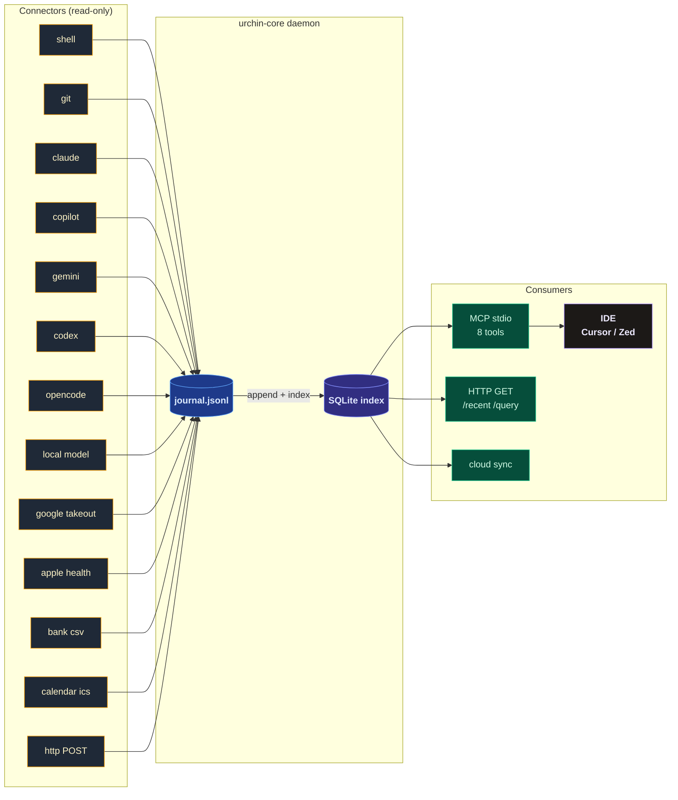

<div align="center">

# Urchin

**The universal substrate. Every tool, one memory.**


</div>

---

Every platform you touch collects data about you. Your steps on Apple Health, your purchases in your bank app, your location on Google, your watch history on YouTube, your conversations with every AI. They keep it scattered across dozens of silos. They build profiles. They show you nothing.

Urchin runs locally and collects the same data: AI conversations, shell commands, code commits, calendar events, purchases, health metrics, location, search history, watch history. It writes to a single file on your machine. An append-only journal. Yours.

Any agent, IDE, or script can then read that journal. You own the full picture, unified, without any platform's gate in the way.

> Urchin does not own your tools. It reads them.
> Additive. Passive. Silent. Nothing you already use loses anything.

---

## Architecture



Collectors are passive readers. They never write back to source tools. The journal is the append-only spine. SQLite is the queryable index over it. MCP is the read surface for agents and IDEs.

---

## Roadmap

| Feature | Status | Notes |
|---|---|---|
| Core types + journal | ✅ shipped | `Event`, `Journal`, `Identity`, `Config`; append-only JSONL |
| Identity envelope | ✅ shipped | account/device on every event |
| TOML config + env overrides | ✅ shipped | defaults to `~/.config/urchin/config.toml` then env |
| HTTP intake | ✅ shipped | `POST /ingest`, `POST /ingest/batch`, `GET /health`; loopback-only |
| MCP server (stdio) | ✅ shipped | JSON-RPC 2.0, 8 tools |
| Daemon mode | ✅ shipped | `urchin serve`; connector loop + intake server |
| Dev/AI connectors | ✅ shipped | shell, git, claude, copilot, gemini, codex, opencode, local-model |
| Personal data connectors | ✅ shipped | google-takeout, apple-health, bank-csv, calendar |
| Personal EventKind variants | ✅ shipped | purchase, location, health_metric, calendar_event, search_query, watch_history |
| EventMeta struct | ✅ shipped | structured optional fields for personal data kinds |
| Ephemeral mode | ✅ shipped | file-backed flag, cross-process aware |
| Intake auth | ✅ shipped | optional Bearer token, loopback-only |
| SQLite projection index | ✅ shipped | WAL mode, O(log n) queries, `urchin rebuild-index` |
| OS-level connectors | 🔲 planned | active window, inotify file watcher, AI traffic intercept |
| WebView intercept | 🔲 planned | Tauri captures AI web UIs natively |
| Vector embeddings | 🔲 planned | semantic search upgrade from token-cosine to real vectors |
| `.urchinignore` runtime | 🔲 planned | spec in SOVEREIGNTY.md, not yet wired |
| Multi-device sync | 🔲 planned | deterministic chunk sync |

**125 tests** across `urchin-core` (28), `urchin-intake` (12), `urchin-mcp` (16), `urchin-collectors` (69).

---

## Quick start

```bash
git clone https://github.com/orinadus-systems/urchin
cd urchin
cargo build                        # → target/debug/urchin
./target/debug/urchin doctor       # verify identity + journal state
```

---

## Commands

| Command | Purpose |
|---|---|
| `urchin doctor` | identity, config source, paths, journal stats |
| `urchin ingest` | write a single event from the CLI |
| `urchin serve` | start HTTP intake + collector tick loop (daemon) |
| `urchin mcp` | run MCP server over stdio (JSON-RPC 2.0) |
| `urchin collect shell` | run shell collector once |
| `urchin collect git --repo <path>` | run git collector |
| `urchin collect claude` | run Claude collector |
| `urchin collect copilot` | run Copilot collector |
| `urchin collect gemini` | run Gemini collector |
| `urchin collect codex` | run Codex CLI collector |
| `urchin collect opencode` | run OpenCode collector |
| `urchin collect local-model` | run local model drop-file collector |
| `urchin collect all` | run every collector |
| `urchin recent [--n N] [--source S]` | show last N events |
| `urchin query <text>` | keyword search across journal |
| `urchin collect google-takeout` | ingest Google Takeout export (location, search, YouTube) |
| `urchin collect apple-health` | ingest Apple Health export.xml |
| `urchin collect bank-csv` | ingest bank CSV files |
| `urchin collect calendar` | ingest .ics calendar files |
| `urchin sync` | push journal to cloud |
| `urchin rebuild-index` | wipe and rebuild SQLite index from JSONL source of truth |

### Local model drop file

Any local inference harness (Ollama, LM Studio, llama.cpp, etc.) can push events to Urchin by
appending newline-delimited JSON to `~/.local/share/urchin/local-model.jsonl`:

```json
{"prompt":"fix the memory leak","model":"ollama:mistral","ts":"2026-05-01T10:00:00Z","workspace":"/opt/project"}
```

Fields: `prompt` (required), `model` (optional), `ts` (RFC3339, optional), `workspace` (optional).
Urchin reads from this file; it never writes to it. The collector is a no-op when the file doesn't exist.

---

## Crates

```
crates/
  urchin-core        zero I/O: Event, Journal, Identity, Config
  urchin-intake      axum: POST /ingest, POST /ingest/batch, GET /health (127.0.0.1:18799)
  urchin-mcp         MCP over stdio: 8 tools, JSON-RPC 2.0
  urchin-collectors  all connectors: shell, git, claude, copilot, gemini, codex, opencode,
                     local-model, google-takeout, apple-health, bank-csv, calendar
  urchin-sdk         shared types for external integrations
  urchin-cli         single binary: target/debug/urchin
```

---

## Event model

| Field | Type | Notes |
|---|---|---|
| `id` | UUID v4 | generated on create |
| `timestamp` | UTC ISO-8601 | |
| `source` | string | `claude` / `copilot` / `shell` / `mcp` / ... |
| `kind` | enum | `conversation` / `agent` / `command` / `commit` / `file` / `decision` / `purchase` / `location` / `health_metric` / `calendar_event` / `search_query` / `watch_history` / `other` |
| `content` | string | the payload |
| `workspace` / `session` / `title` / `tags` | optional | context |
| `actor` | optional | `{ account, device, workspace }` |
| `meta` | optional | structured fields for personal data kinds (see [EVENTS.md](EVENTS.md)) |

Append-only JSONL. Events are never mutated. Unknown fields are ignored on read.

---

## MCP tools

| Tool | Args | Purpose |
|---|---|---|
| `urchin_status` | (none) | event count, last event, paths, identity |
| `urchin_ingest` | `content`, `workspace` | write a structured event |
| `urchin_recent_activity` | `hours`, `source`, `limit` | recent events, newest first |
| `urchin_project_context` | `project` | match by content, tags, or workspace path |
| `urchin_search` | `query` | case-insensitive substring search |
| `urchin_workspace_context` | `path` | events scoped to a specific workspace CWD; call at session start |
| `urchin_remember` | `content`, `tags?`, `workspace?` | quick-capture without required workspace |
| `urchin_ephemeral` | `action: start\|end\|status` | burn mode; suppresses all writes until `end` |

Errors return `isError: true`. Queries return one line per event: `[timestamp] source | content`.

---

## IDE setup

### Cursor

The repo ships `.cursor/mcp.json`. Cursor picks it up automatically when you open the repo.
Requires `urchin` on `PATH` (`cargo install --path crates/urchin-cli` or add `~/.cargo/bin` to PATH).

```json
{
  "mcpServers": {
    "urchin": {
      "command": "urchin",
      "args": ["mcp"]
    }
  }
}
```

### Zed

Add to `~/.config/zed/settings.json`:

```json
{
  "context_servers": {
    "urchin": {
      "command": {
        "path": "urchin",
        "args": ["mcp"]
      }
    }
  }
}
```

### VS Code / Copilot Chat

Add to `.vscode/mcp.json` in your workspace:

```json
{
  "servers": {
    "urchin": {
      "type": "stdio",
      "command": "urchin",
      "args": ["mcp"]
    }
  }
}
```

After adding: restart the IDE. Run `urchin_status` in the assistant to confirm the substrate is reachable.

---

## Configuration

```toml
# ~/.config/urchin/config.toml  (all fields optional)
vault_root   = "/home/you/brain"
journal_path = "/home/you/.local/share/urchin/journal/events.jsonl"
intake_port  = 18799
cloud_url    = "https://www.orinadus.com/api/urchin-sync"
cloud_token  = "<bearer-token>"
```

| Env var | Overrides | Default |
|---|---|---|
| `URCHIN_VAULT_ROOT` | `vault_root` | `~/brain` |
| `URCHIN_JOURNAL_PATH` | `journal_path` | `~/.local/share/urchin/journal/events.jsonl` |
| `URCHIN_INTAKE_PORT` | `intake_port` | `18799` |
| `URCHIN_ACCOUNT` | identity account | `$USER` |
| `URCHIN_DEVICE` | identity device | hostname |
| `URCHIN_REPO_ROOTS` | git repos | colon-separated paths |
| `URCHIN_LOG` | log filter | `urchin=info` |

---

## Rules

> [!IMPORTANT]
> 1. `urchin-core` has zero I/O. Pure types only.
> 2. The journal is append-only. Events are never mutated.
> 3. Vault writes happen only inside `<!-- URCHIN:* -->` marker blocks. Human content is never touched.
> 4. Collectors read. They never write back to source tools.
> 5. MCP is stdio, not HTTP.
> 6. One binary: `cargo build` → `target/debug/urchin`.

---

<div align="center">
<sub>Local-first. Additive. The substrate is not a product. It is infrastructure.</sub>
</div>
